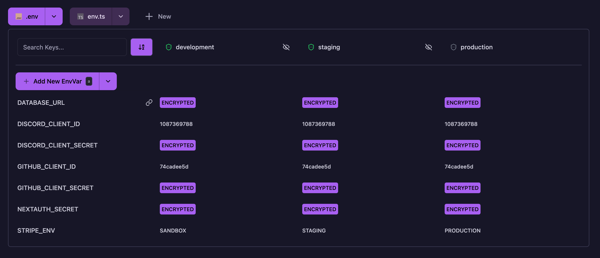

<p align="center">
  <br/>
  
  <h3 align="center">Gitenvs</h3>
  <p align="center">Save your environment variables in git – encrypted.</p>
  
  <p align="center">
  <a href="https://www.npmjs.com/package/gitenvs">
    
  </a>
  <a href="https://github.com/SODEFA-GmbH-Co-KG/gitenvs/blob/main/LICENSE">
    
  </a>
  <br/>
  <br/>
  Gitenvs is a tool that lets you securely store environment variables in your git repository by encrypting them with public/private key pairs. It provides a modern web UI for managing variables across multiple environments and files, with features like importing from .env files, linking shared variables in monorepos, and granular access control through environment-specific encryption keys.
  </p>
  
</p>

## 🚀 How to Setup

Just run

```bash
npx gitenvs@latest
```

A UI is automatically opened in your browser. Run through the wizard to set up gitenvs.

## ✨ Features

- **Multi env file support**: Useful for monorepos with different apps and different environments.
- **Link env vars between files**: Link env vars between files. Useful if you have a shared env var in a monorepo.
- **Encrypt values**: Your secrets are encrypted and can therefore be securely stored in your git repository.
- **Decrypt env vars in the UI** to check the content. Can be toggled per stage. (Private key required)
- **Import existing env vars**:
  - Import .env files from your project folder.
  - Import by pasting .env contents in the UI.
- **Vercel integrations**:
  - Import you env vars from vercel and delete them afterwards.
  - Setup required env vars in vercel automatically for CI/CD.
- **Fully keyboard navigable**: Use arrow keys and shortcuts to navigate through the UI.
- **.env or .ts**: You can use .env or .ts files to write your environment variables.
- **Public/Private key encryption**: Everyone can encrypt env vars for all stages, but only those with the private key can decrypt them. This grants you control over who can see your env vars in different stages.
- **Decrypt and generate files** in your CI/CD pipeline.
  - just provide the passphrase and your desired stage in the pipeline to generate the files

## 🤔 Why?

- **Consistency**: You can easily share your new environment variables with your team. If you have the latest branch commit, you have the latest environment variables.
- **Security and version control**: Your environment variables are encrypted and securely committed in your repository. No fear of loosing your secrets.
- **Branch-specific environments**: Maintain different environment variables per (feature-) branch and automatically apply them when merging, eliminating manual configuration in production.
- **Multi-stage environments**: Maintain separate environment variables for development, staging, and production environments.
- **Access Control**: Provide your developers only with the necessary env vars for their stage.
- **Single source of truth**: No need to worry about keeping your env vars in sync across multiple cloud services or CI/CD pipelines.
- **Ease of use in monorepos**: No need to manually copy env vars from one file to another and always keep them in sync.
