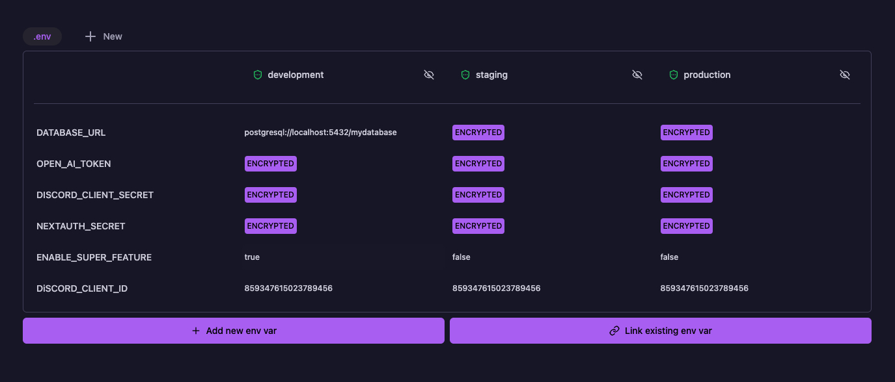

<p align="center">
  <br/>
  
  <h3 align="center">Gitenvs</h3>
  <p align="center">Save your environment variables in git – encrypted.</p>
  
  <p align="center">
  <a href="https://www.npmjs.com/package/gitenvs">
    
  </a>
  <a href="https://github.com/SODEFA-GmbH-Co-KG/gitenvs/blob/main/LICENSE">
    
  </a>
  <br/>
  <br/>
  Gitenvs is a tool that lets you securely store environment variables in your git repository by encrypting them with public/private key pairs. It provides a modern web UI for managing variables across multiple environments and files, with features like importing from .env files, linking shared variables in monorepos, and granular access control through environment-specific encryption keys.
  </p>
  
</p>

## ✨ Features

- **Multi env file support**: Useful for monorepos with different apps and different environments.
- **Link env vars between files**: Link env vars between files. Useful if you have a shared env var in a monorepo.
- **Decrypt env vars in the UI** to check the content. Can be toggled per stage.
- **Import existing env vars**: 
  - Import .env files in your project folder.
  - Import by pasting .env contents in the UI.
  - Import directly from vercel.
- **Fully keyboard navigable**: Use arrow keys and shortcuts to navigate through the UI.
- **.env or .ts**: You can use .env or .ts files to write your environment variables.
- **Public/Private key encryption**: Everyone can encrypt env vars, but only those with the private key can decrypt them.

## 🚀 How to Run

Just run

```bash
npx gitenvs
```

A UI is automatically opened in your browser. Run through the wizard to set up gitenvs.

## 🤔 Why?

- **Consistency**: You can easily share your environment variables with your team. Run `git pull main` and you have the latest environment variables.
- **Encrypted**: Your environment variables are encrypted and securely stored in your repository.
- **Branch-specific environments**: Maintain different environment variables per (feature-) branch and automatically apply them when merging, eliminating manual configuration in production.
- **Multi-stage environments**: Maintain separate environment variables for development, staging, and production environments.
- **Access Control**: Developers only have access to development environment variables through a development-specific encryption passphrase. Without the staging/production passphrases, they cannot decrypt environment variables for those environments.
