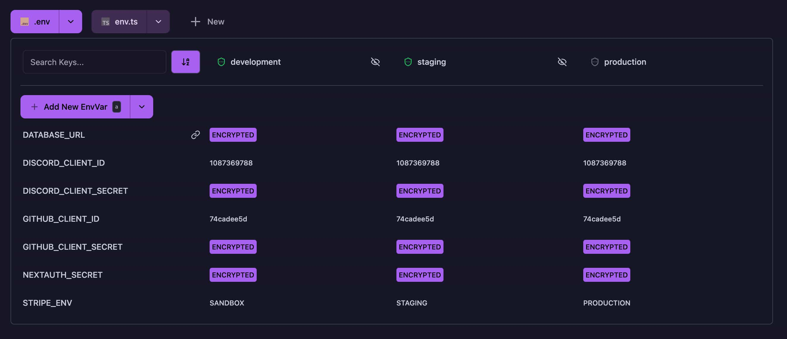
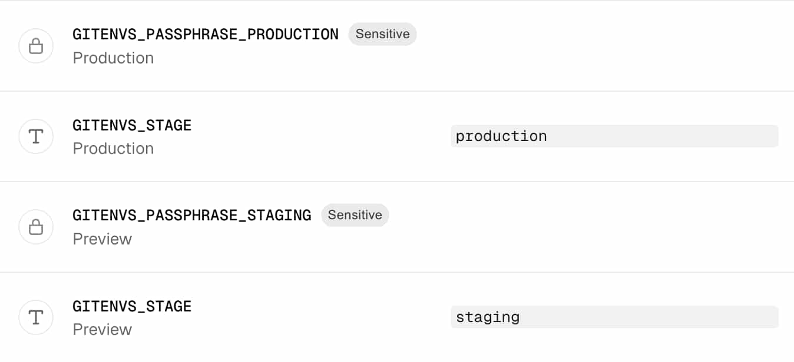

[](https://www.npmjs.com/package/gitenvs)
[](https://github.com/SODEFA-GmbH-Co-KG/gitenvs/blob/main/LICENSE)

<p align="center">
  <br/>
  
  <h3 align="center">Gitenvs</h3>
  <p align="center">Store your environment variables in git – encrypted.</p>

  <p align="center">
  Gitenvs is a tool that lets you securely store environment variables in your git repository by encrypting them with public/private key pairs. It provides a modern web UI for managing variables across multiple environments and files, with features like importing from .env files, linking shared variables in monorepos, and granular access control through environment-specific encryption keys.
  </p>
  
</p>

## 🚀 How to Setup

Make sure you have node >= 20 installed.

Just run

```bash
npx gitenvs@latest
```

A UI is automatically opened in your browser. Run through the wizard to set up gitenvs.

## ✨ Features

- **Multi env file support**: Useful for monorepos with different apps and different environments.
- **Link env vars between files**: Link env vars between files. Useful if you have a shared env var in a monorepo.
- **Encrypt values**: Your secrets are encrypted and can therefore be securely stored in your git repository.
- **Decrypt env vars in the UI** to check the content. Can be toggled per stage. (Private key required)
- **Import existing env vars**:
  - Import .env files from your project folder.
  - Import by pasting .env contents in the UI.
- **Vercel integrations**:
  - Import you env vars from vercel and delete them afterwards.
  - Setup required env vars in vercel automatically for CI/CD.
- **Fully keyboard navigable**: Use arrow keys and shortcuts to navigate through the UI.
- **.env or .ts**: You can use .env or .ts files to write your environment variables.
- **Public/Private key encryption**: Everyone can encrypt env vars for all stages, but only those with the private key can decrypt them. This grants you control over who can see your env vars in different stages.
- **Decrypt and generate files** in your CI/CD pipeline.
  - just provide the passphrase and your desired stage in the pipeline to generate the files

## 🤔 Why?

- **Consistency**: You can easily share your new environment variables with your team. If you have the latest branch commit, you have the latest environment variables.
- **Security and version control**: Your environment variables are encrypted and securely committed in your repository. No fear of loosing your secrets.
- **Branch-specific environments**: Maintain different environment variables per (feature-) branch and automatically apply them when merging, eliminating manual configuration in production.
- **Multi-stage environments**: Maintain separate environment variables for development, staging, and production environments.
- **Access Control**: Provide your developers only with the necessary env vars for their stage.
- **Single source of truth**: No need to worry about keeping your env vars in sync across multiple cloud services or CI/CD pipelines.
- **Ease of use in monorepos**: No need to manually copy env vars from one file to another and always keep them in sync.

## 📚 Documentation

### File structure:

- `gitenvs.json`
  - include this file in your git repo
  - do not edit this file manually
  - this file includes:
    - the stages including their name, public keys as well as encrypted private keys
    - the env files including their name, path and type
    - the env vars including their name and value (encrypted if specified)
- `gitenvs.passphrases.json` (do **not** include this file in your git repo)
  - this file is used to store the passphrases for the stages.
  - following this format:
    ```json
    [
      {
      "passphrase": "your-development-passphrase",
      "stageName": "development"
      },
      ...
    ]
    ```
  - as the project owner, you should keep a file version with every stage and passphrase somewhere safe, e.g. in a password manager
  - share this file with your team, including only the passphrases they require
  - the passphrases are required to decrypt the env vars in the `gitenvs.json` file
- You can specify a different folder for your gitenvs files by setting the `GITENVS_DIR` env var

### CLI commands:

- `npx gitenvs@latest` - opens the UI, if its the first time in this project, the setup wizard will show up automatically
  - if gitenvs is installed as a dev dependency, you just run `gitenvs`
- `gitenvs setup` – set up gitenvs non-interactively for scripts and AI agents. It creates `gitenvs.json`, writes `gitenvs.passphrases.json`, updates `.gitignore`, and can install/package-wire gitenvs.
  - useful defaults:
    ```bash
    bunx gitenvs setup --yes
    ```
  - optional parameters:
    - `--stages <stages>` – comma-separated stage names. Default: `development,staging,production`
    - `--file <filePath>` – env file path to configure. Default: `.env`
    - `--file-name <fileName>` – display label for the env file
    - `--file-type <fileType>` – `dotenv` or `.ts`. Default: `dotenv`
    - `--force` – overwrite existing `gitenvs.json` and `gitenvs.passphrases.json`
    - `--no-gitignore`, `--no-install`, `--no-postinstall`, `--no-scripts` – skip individual project setup steps
- `gitenvs set` – add or update an env var (encrypted by default). Designed for scripts and AI agents – no passphrase required since encryption uses each stage's public key from `gitenvs.json`.
  - required parameters:
    - `--file <filePath>` – the env file to add the var to, matched against `envFiles[].filePath` in `gitenvs.json` (e.g. `--file .env`)
    - `--key <key>` – the env var key (e.g. `DATABASE_URL`)
  - value input: provide exactly one of:
    - `--value <value>` – the value to store. Convenient, but avoid for sensitive values in automation because argv can be logged.
    - `--value-env <envName>` – read the value from an environment variable.
    - `--value-stdin` – read the value from stdin.
  - optional parameters:
    - `--stage <stage>` – limit the change to a single stage. Without it the value is written to **all** stages.
    - `--no-encrypt` – store the value as plaintext. By default the value is encrypted with the stage's public key.
  - if a var with the same `key` already exists in that file, only the targeted stages are updated; other stages are left untouched.
- `gitenvs create` – create all configured env files in their specified paths
  - For your convenience this command can be specified in the `postinstall` of your package.json to automatically create the env files after installing your packages. The setup wizard offers you to add this command to your package.json.
  - This command uses the passphrase and stage specified in env vars
    - `GITENVS_STAGE=<stage>` (for example `GITENVS_STAGE=development`)
    - `GITENVS_PASSPHRASE_<STAGE>=<passphrase>` (for example `GITENVS_PASSPHRASE_DEVELOPMENT=Y1Ib...`)
  - optional parameters:
    - `--stage <stage>` (default: development) - the stage to create the env files for (env var > cli param > default)
    - `--passphrase <passphrase>` - the passphrase to use for the stage (cli param > env var)
    - `--passphrasePath <passphrasePath>` - the path to the passphrase file
- `gitenvs run --file <filePath> --stage <stage> -- <command> [...args]` – run a program with decrypted env vars without writing `.env` files.
  - This uses the same stage and passphrase lookup as `gitenvs create`: `GITENVS_STAGE`, `GITENVS_PASSPHRASE_<STAGE>`, `--passphrase`, or `--passphrasePath`.
  - `--file <filePath>` selects the env file from `gitenvs.json`. It is optional only when the project has exactly one configured env file.
  - Gitenvs starts the child process directly with inherited `stdin`, `stdout`, and `stderr`, and exits with the child process exit code.
  - Put command options after `--` so they are passed through unchanged, for example:
    ```bash
    gitenvs run --file apps/web/.env --stage development -- npm run dev -- --host 0.0.0.0
    ```
- `gitenvs status` – print a secret-safe status summary. Add `--json` for machine-readable output.
- `gitenvs doctor` – validate the local setup and exit non-zero if it finds issues. Add `--json` for machine-readable output.
- `gitenvs passphrases validate` – validate `gitenvs.passphrases.json` without printing passphrase values. Add `--json` for machine-readable output.
- `gitenvs ci env --stage <stage>` – print the CI env var names needed to run `gitenvs create` for a stage without printing any secrets. Add `--json` for machine-readable output.

### Agent and provider integrations

Gitenvs intentionally keeps provider sync out of the core CLI. A company-specific agent or wrapper can read `gitenvs.passphrases.json` and write it to Bitwarden, Vercel, GitHub Actions, or another secret backend. Gitenvs provides the local, portable contract: `gitenvs.json`, `gitenvs.passphrases.json`, `gitenvs set --value-env/--value-stdin`, `gitenvs create`, and secret-safe status/CI metadata commands.

### Example setup for cloud hosting providers

  
